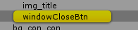

# UITools
常用的Unity UI工具

## 1.快速选中UI

添加**QuickSelectUI** Component。在Game窗口快速选中带**Raycast**的UI节点，展开并且高亮。

## 2.设置资源格式可视化

把**Framework文件夹**复制到项目。

Unity工具栏**Tools/AssetFormat**，打开界面。如果没有资源格式设置，可以点击**创建**按钮创建配置；如果已有资源格式设置，但是本地没有缓存路径，可以点击**加载**；创建/加载后，路径会缓存在本地；具体效果如下：

